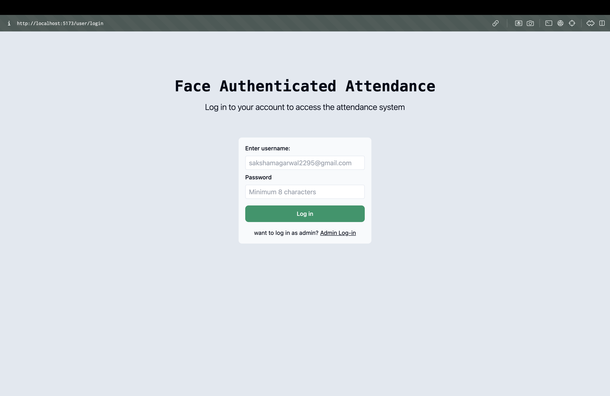
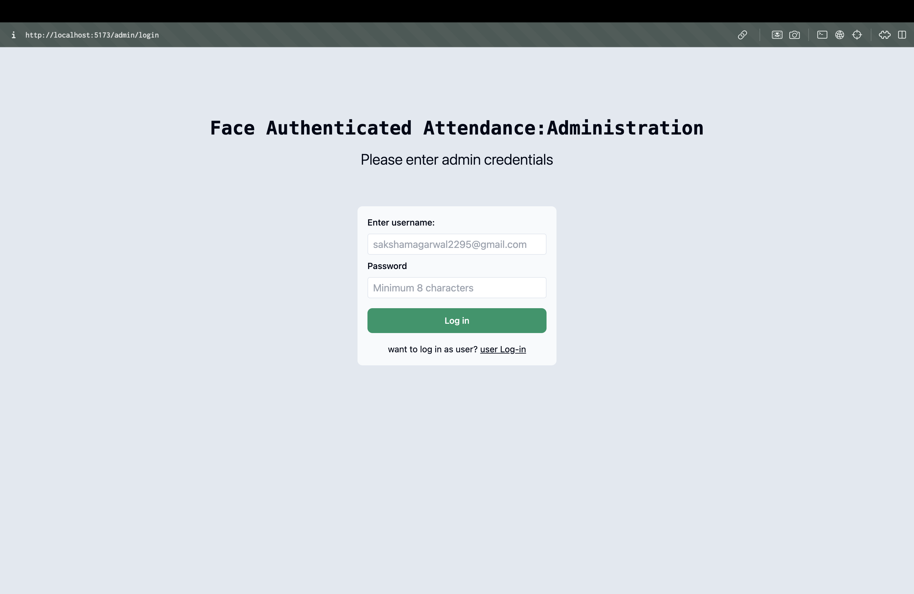
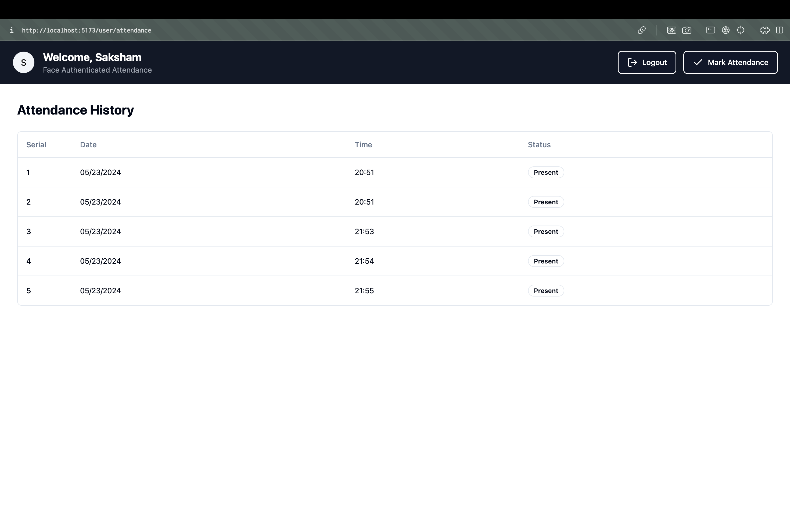
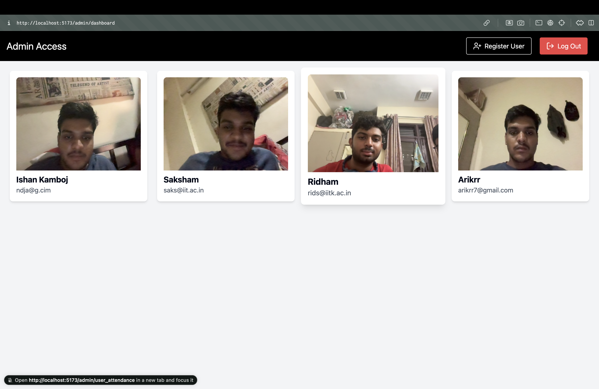
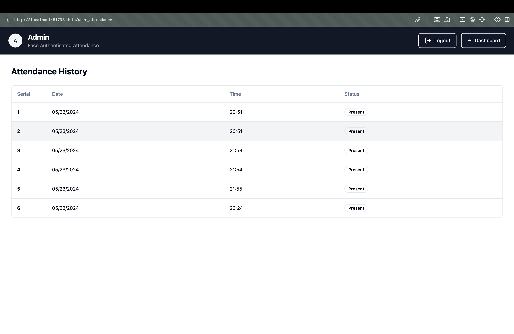
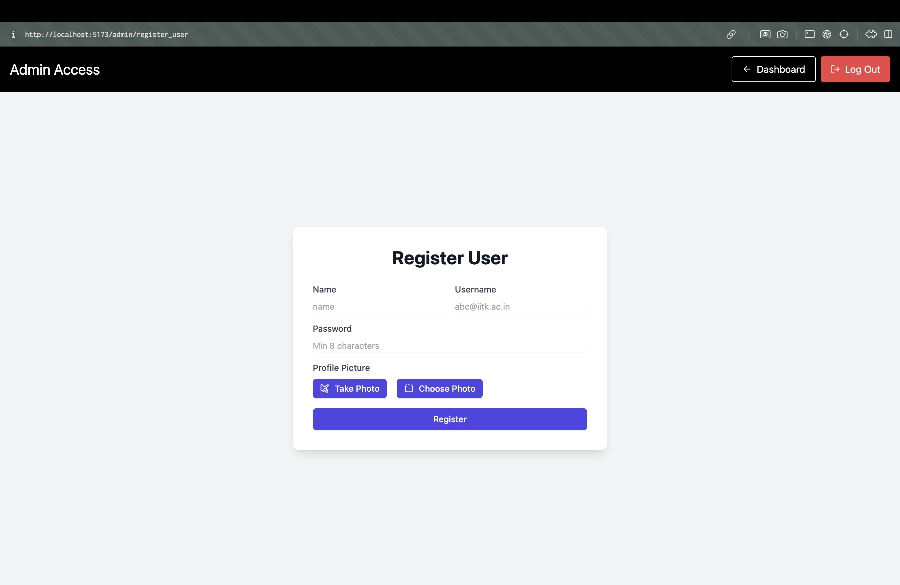
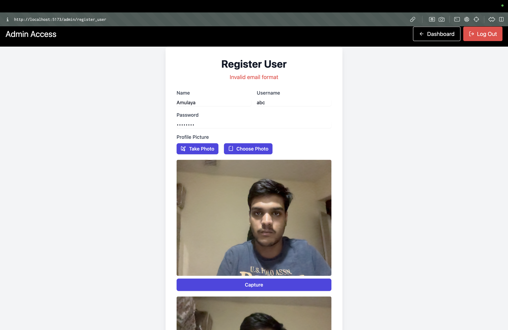
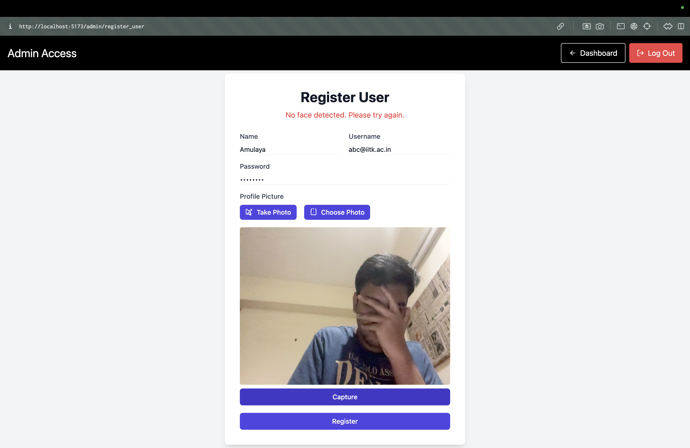
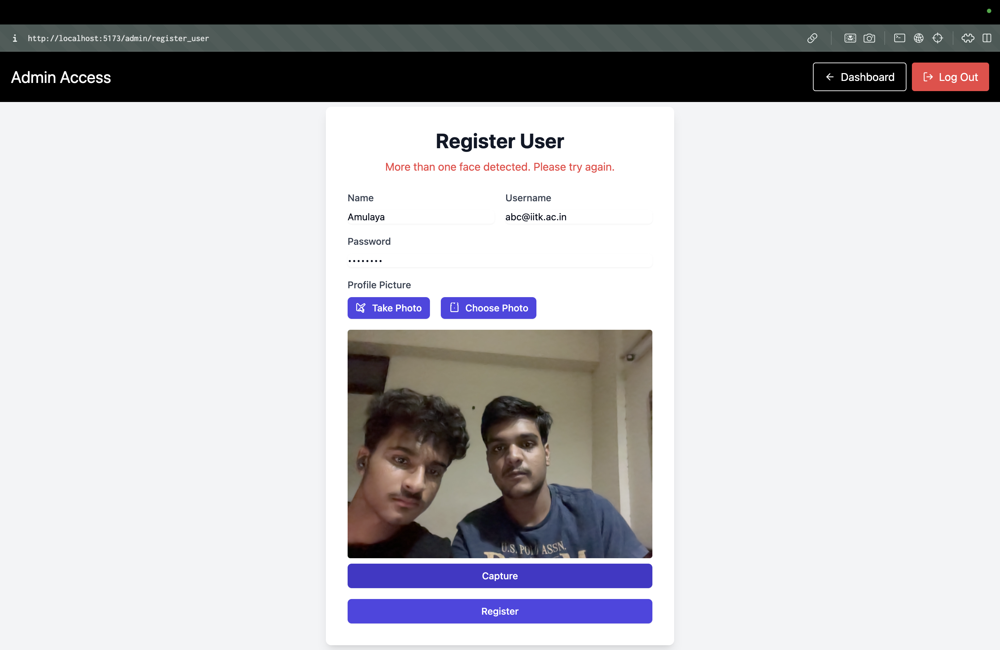

# Face authenticated attendance web-app

### Instructions to run:
- Clone the repository.
- download the dependencies for both frontend and backend using npm install in both.
- in the backend directory in terminal run node index.js.
- in the frontend directory in terminal, run npm run dev.
- visit the generated local host link in frontend in your browser.
- model username and password for admin access are:
    - username: sakshamag23@iitk.ac.in
    - password: code_saks

### Features:
- #### Tech Stack: Express,MongoDB,React (with Vite), face-api.js, shadCN ui components

- The app has login page for both user and admin

- Attendance history for the user: Displays all the past attendance marked by the user along with time stamps

- Mark attendance for the user:
Uses face-api.js if the captured image matches the image of the user logged in.If it matches, it marks the attendance other wise displays error message:

When I used id from which my face was registered:

when i logged in from someone else's account (refer dashboard photo of admin)

logout button logs out and goes to user login page

- admin dashboard page

- user attendance of a user as accessed by admin by clicking on the corresponding tile in dashboard

- Register user page: 

makes use of zod to ensure valid inputs are provided in textual fields

also uses face-api.js and pre trained models to ensure exactly one face is detected

